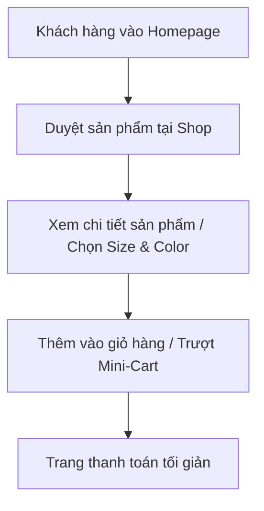

# Tài liệu Đặc tả Yêu cầu Giao diện (Frontend Requirements Specification)
## Dự án: HKT Fashion (Thương hiệu Thời trang Tối giản)
**Trạng thái:** Sẵn sàng phát triển | **Phong cách:** Minimalist White-Dominant, Hiện đại, Thanh lịch

Tài liệu này xác định các yêu cầu nghiệp vụ giao diện (UI/UX) và tiêu chí nghiệm thu (Acceptance Criteria) cho đội ngũ phát triển Frontend. Đội ngũ phát triển dựa vào đây để thiết kế bố cục, viết mã CSS/JS và triển khai trên Flatsome Child Theme.

---

## 📌 BẢN ĐỒ TỆP TIN & TRANG CẦN XỬ LÝ (SCOPE OF WORK)

### Các Trang Cần Triển khai Giao diện:
1.  **Trang chủ (Homepage):** Áp dụng template tùy chỉnh để dựng banner grid, sliders.
2.  **Trang Cửa hàng (Shop / Catalog Page):** Triển khai lưới sản phẩm, sidebar bộ lọc thuộc tính AJAX, hiển thị thẻ sản phẩm.
3.  **Trang Chi tiết Sản phẩm (Single Product Page):** Triển khai thư viện ảnh, Swatches chọn màu/size, khối cam kết, và nút mua hàng tương phản cao.
4.  **Trang Thanh toán (Checkout Page):** Layout lại thành 2 cột tối giản, xử lý dropdown địa lý động và loại bỏ trường dư thừa trên UI.
5.  **Giao diện di động (Mobile UI):** Thanh điều hướng cố định chân trang (Sticky Mobile Bottom Nav).

### Các Tệp tin (Files) Frontend chịu trách nhiệm:
| Đường dẫn tệp tin | Trạng thái | Nhiệm vụ chính |
| :--- | :--- | :--- |
| `wp-content/themes/flatsome-child/style.css` | `MODIFY` | Khai báo CSS variables (Design Tokens), viết toàn bộ mã CSS override giao diện Flatsome. |
| `wp-content/themes/flatsome-child/template-custom-home.php` | `MODIFY` | Chỉnh sửa cấu trúc lưới Banner Grid, Sliders bằng shortcode UX Builder của Flatsome. |
| `assets/js/hkt-custom.js` | `NEW` | Tạo mới file JS để xử lý gọi API Tỉnh/Thành động, điều khiển hiệu ứng popup Size Guide và giỏ hàng nhanh (Mini-Cart). |
| `header.php` / `footer.php` | `MODIFY` | Nhúng file JS mới (`hkt-custom.js`) và render cấu trúc HTML cho thanh Bottom Navigation trên Mobile. |

---

## 1. Thiết kế Nhận diện & Design System (Design Tokens)

Frontend cần định cấu hình hệ thống giao diện dựa trên các thông số thiết kế sau:

### 1.1. Bảng màu (Color Palette)
*   **Màu chủ đạo (Primary):** Trắng (#FFFFFF) làm nền chủ đạo (chiếm 60-70% diện tích trang) để tạo không gian thoáng đãng, làm nổi bật hình ảnh sản phẩm thời trang.
*   **Màu phụ (Secondary):** Tông màu Off-White (#FAF9F6) hoặc Xám cực nhẹ (#F8F9FA) để phân tách các khu vực đệm, khung thẻ sản phẩm và chân trang.
*   **Màu chữ (Typography Color):** Xám Slate đậm (#2B2B2B hoặc #333333). Tránh dùng màu đen tuyệt đối (#000000) cho văn bản dài để giảm mỏi mắt cho người dùng.
*   **Màu điểm nhấn (Accent/CTA):** Đen nhám tối giản (#1A1A1A) sử dụng cho các nút hành động chính (Mua Ngay, Checkout, Đăng ký) và các nhãn quan trọng nhằm tạo độ tương phản mạnh mẽ.

### 1.2. Typography & Hiệu ứng
*   **Font chữ:** Headings/Buttons dùng `Montserrat` (hoặc font tương đương có độ dày tốt); Body text dùng `Inter` (hoặc font không chân mượt mà trên mobile).
*   **Bo góc (Border Radius):** Giới hạn từ `2px` đến `4px` (hoặc vuông góc) để thể hiện sự cứng cáp, hiện đại, thanh lịch của ngành thời trang cao cấp.
*   **Độ rộng khung trang (Layout Grid):** Max-width chuẩn `1200px`.

---

## 2. Đặc tả Nghiệp vụ Giao diện & Tiêu chí Nghiệm thu (Acceptance Criteria)

### 2.1. Trang chủ (Homepage)
*   **Mục tiêu:** Trưng bày các bộ sưu tập thời trang mới nhất và thu hút người dùng đi sâu vào trang cửa hàng.
*   **Yêu cầu hành vi:**
    *   **Sticky Header:** Khi cuộn trang xuống, Header tự động thu nhỏ độ cao nhẹ và ghim cố định ở trên cùng. Khi cuộn ngược lên, giữ nguyên trạng thái cố định.
    *   **Ajax Search:** Ô tìm kiếm trên header phải hiển thị kết quả gợi ý sản phẩm (bao gồm ảnh thumbnail, tên, giá bán) ngay khi người dùng gõ tối thiểu 3 ký tự mà không cần tải lại trang.
    *   **UX Banner Grid:** Bố cục dạng lưới bất đối xứng. Toàn bộ hình ảnh banner phải được tối ưu hiển thị, chữ trên banner phải dễ đọc trên các nền ảnh khác nhau (sử dụng overlay mờ nếu cần).

### 2.2. Trang Cửa hàng & Danh mục (Shop / Catalog Page)
*   **Mục tiêu:** Hỗ trợ người dùng tìm kiếm và lọc sản phẩm nhanh chóng.
*   **Yêu cầu hành vi:**
    *   **Card sản phẩm (Product Card):**
        *   Khi di chuột (hover) vào card sản phẩm, ảnh đại diện sẽ tự động chuyển sang ảnh thứ 2 (ảnh mặt sau hoặc ảnh phối đồ khác).
        *   Hiển thị nút "Xem nhanh" (Quick View) khi hover.
        *   Nhãn "SALE" phải sử dụng phong cách tối giản (khung chữ nhật nhỏ, màu đen nhám chữ trắng hoặc ngược lại), không dùng các tông màu đỏ/cam quá sặc sỡ.
    *   **Bộ lọc thuộc tính (AJAX Filter):**
        *   Lọc màu sắc (Color Swatches) phải hiển thị dạng các nút tròn màu trực quan tương ứng với màu sản phẩm thực tế.
        *   Lọc kích thước (Size Swatches) hiển thị dạng các ô vuông (S, M, L, XL).
        *   Khi click chọn bộ lọc, trang sản phẩm tự động cập nhật danh sách qua AJAX mà không được reload lại toàn bộ trang.

### 2.3. Trang Chi tiết Sản phẩm (Single Product Page)
*   **Mục tiêu:** Cung cấp đầy đủ thông tin để người dùng đưa ra quyết định mua hàng.
*   **Yêu cầu hành vi:**
    *   **Trình diễn ảnh (Product Gallery):** Hỗ trợ zoom ảnh khi di chuột (trên Desktop) và vuốt chuyển ảnh (trên Mobile). Hỗ trợ phóng to ảnh (Lightbox) có độ nét cao.
    *   **Biến thể sản phẩm (Variation Selection):**
        *   Bắt buộc thay thế dropdown chọn size/màu mặc định thành các nút Swatches (ô vuông/tròn).
        *   *Tiêu chí nghiệm thu:* Nếu một biến thể (kết hợp màu sắc + kích thước) đã hết hàng trong kho, nút tương ứng phải bị làm mờ (opacity thấp), gạch chéo và người dùng không thể chọn được.
    *   **Nút Mua Ngay:** Phải có kích thước lớn, màu tương phản cực mạnh (Đen nhám), hiển thị chữ viết hoa rõ ràng "MUA NGAY".
    *   **Bảng Hướng dẫn chọn Size (Size Guide Link):** Đặt cạnh khu vực chọn Size. Khi click sẽ hiển thị một Pop-up (Modal) chứa bảng thông số chiều cao/cân nặng tương ứng.
    *   **Khối Cam kết Tin cậy (Trust Badges):** Hiển thị ngay dưới nút Mua Ngay với thiết kế chữ thanh mảnh, sử dụng icon đơn giản để nhấn mạnh chính sách: chính hãng, đổi trả và miễn phí vận chuyển.

### 2.4. Trang Giỏ hàng & Thanh toán (Cart & Checkout)
*   **Mục tiêu:** Giảm thiểu tối đa tỷ lệ bỏ rơi giỏ hàng bằng cách đơn giản hóa luồng thanh toán.
*   **Yêu cầu hành vi:**
    *   **Mini-Cart Drawer:** Khi người dùng click nút "Mua Ngay" hoặc click vào giỏ hàng, một bảng giỏ hàng sẽ trượt ra từ bên phải màn hình (Off-canvas). Người dùng có thể tăng/giảm số lượng sản phẩm ngay tại đây.
    *   **Form Thanh toán 2 Cột (Desktop):** Cột trái điền thông tin giao hàng, cột phải hiển thị tóm tắt đơn hàng và các phương thức thanh toán.
    *   **Form Điền Thông Tin Giao Hàng Việt Nam:**
        *   *Tiêu chí nghiệm thu:* Biểu mẫu chỉ hiển thị các trường: Họ tên, Số điện thoại, Email, Tỉnh/Thành phố, Quận/Huyện, Phường/Xã và Địa chỉ chi tiết.
        *   Dropdown chọn địa giới hành chính (Tỉnh/Thành -> Quận/Huyện -> Phường/Xã) phải tải động theo cấp bậc (chọn Tỉnh mới hiển thị Huyện tương ứng).
        *   Loại bỏ các trường rườm rà: Zip/Postal code, Quốc gia, Địa chỉ dòng 2, Tên công ty.

---

## 3. Trải nghiệm Thiết bị Di động (Mobile First Guidelines)

Vì phần lớn khách hàng thời trang mua sắm trên điện thoại, Frontend cần tuân thủ nghiêm ngặt các yêu cầu sau:
1.  **Bottom Navigation Bar:** Thiết kế thanh công cụ ghim dưới chân màn hình điện thoại (Trang chủ, Tìm kiếm, Giỏ hàng có huy hiệu số lượng sản phẩm, Tài khoản).
2.  **Kích thước vùng chạm (Tap Targets):** Tất cả các liên kết, nút bấm, ô chọn Swatches phải có kích thước tối thiểu `44px x 44px` và khoảng cách an toàn giữa các nút là `8px` để tránh bấm nhầm.
3.  **Tránh giật khung hình (Layout Shift):** Tất cả các khung chứa ảnh phải có tỷ lệ khung hình cố định (Aspect Ratio) để giữ chỗ trước khi ảnh tải xong, ngăn chặn tình trạng nhảy trang khi cuộn (CLS = 0).

---

## 4. Tiêu chí Nghiệm thu Giao diện (Acceptance Criteria - AC)

Đội ngũ phát triển Frontend và bộ phận kiểm thử (QA/QC) sử dụng danh sách này làm tiêu chí đánh giá hoàn thành công việc:

*   **[ ] AC-FE-01: Giao diện Tối giản (Minimalist Style)**
    *   Nền trang hiển thị màu Trắng (#FFFFFF) chủ đạo.
    *   Các đường viền (borders) phân tách các vùng thông tin sử dụng nét mảnh nhẹ (hairline), không sử dụng bóng đổ đậm.
    *   Nút "MUA NGAY" và các nút thanh toán bắt buộc có màu Đen nhám (#1A1A1A) để tạo sự tương phản rõ ràng.
*   **[ ] AC-FE-02: Chuyển đổi Ảnh Sản Phẩm (Hover State)**
    *   Ở trang chủ và trang shop, khi di chuột vào bất kỳ card sản phẩm nào, ảnh đại diện phải chuyển sang ảnh thứ 2 trơn tru.
*   **[ ] AC-FE-03: Bộ lọc Thuộc tính Sản phẩm (AJAX Filters)**
    *   Các bộ lọc Size hiển thị dạng ô vuông, Color hiển thị dạng vòng tròn màu.
    *   Khi click chọn bộ lọc, danh sách sản phẩm hiển thị phải được lọc tự động qua AJAX mà không reload lại toàn bộ trang.
*   **[ ] AC-FE-04: Trải nghiệm Biến thể Chi tiết (Product Variations)**
    *   Thay thế dropdown chọn size/màu mặc định thành nút Swatches trực quan.
    *   Khi một cặp thuộc tính biến thể (Màu + Size) hết hàng, nút kích thước hoặc màu sắc tương ứng phải bị mờ đi (opacity dưới 50%), gạch chéo chéo và người dùng không thể click chọn được.
*   **[ ] AC-FE-05: Giỏ hàng nhanh (Mini-Cart Sidebar)**
    *   Bảng giỏ hàng nhanh phải trượt ra từ bên phải màn hình khi click "MUA NGAY".
    *   Cập nhật số lượng và thành tiền ngay lập tức mà không tải lại trang.
*   **[ ] AC-FE-06: Đơn giản hóa Checkout Form**
    *   Form thanh toán chỉ hiển thị: Họ tên, Số điện thoại, Email (tùy chọn), Tỉnh/Thành phố, Quận/Huyện, Phường/Xã, Địa chỉ cụ thể.
    *   Ẩn hoàn toàn: Quốc gia, Tên công ty, Mã bưu điện (Postcode), Địa chỉ dòng 2.
    *   Dropdown Quận/Huyện chỉ xuất hiện khi đã chọn Tỉnh/Thành phố. Dropdown Phường/Xã chỉ xuất hiện khi đã chọn Quận/Huyện.
*   **[ ] AC-FE-07: Tối ưu hóa Thiết bị Di động**
    *   Bottom Navigation Bar luôn hiển thị ghim cố định ở chân trang mobile.
    *   Kích thước vùng bấm tối thiểu đạt `44px x 44px`.
    *   Điểm số hiệu năng di động đo bằng Google PageSpeed Insights đạt tối thiểu 80 điểm.

